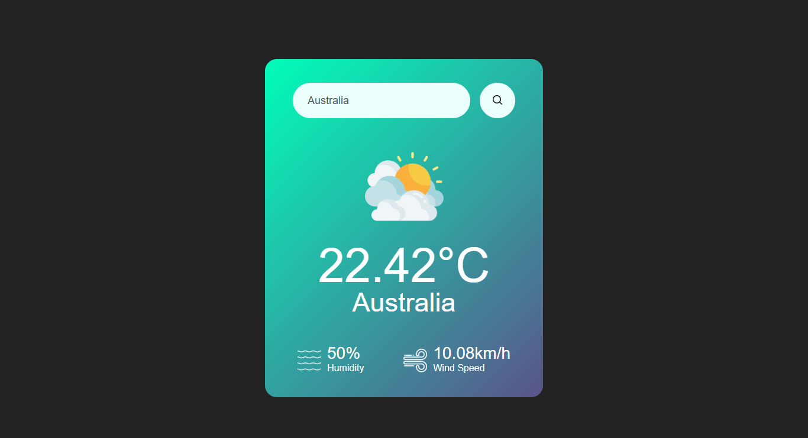

# 🌤️ Weather App

A sleek and minimalistic **Weather App** built with **HTML**, **CSS**, and **JavaScript**. It fetches real-time weather data from the **OpenWeatherMap API** based on any city entered by the user.

---

## 🚀 Live Demo

🔗 [Live Demo](ayaanfarrukh.github.io/Weather-App)  

---

## 🖼️ Preview

  
*A visual example of the app showing temperature, weather icon, city name, humidity, and wind speed.*

---

## ✨ Features

- 🔍 Search any city worldwide
- 🌡️ Displays current temperature
- 🌬️ Wind speed and 💧 humidity info
- 🌦️ Shows weather icon (Cloudy, Rainy, Clear, etc.)
- ❌ Error message for invalid city names
- 📱 Fully responsive design for all devices
- 🎯 Fast and beginner-friendly

---

## 🛠️ Built With

- **HTML5** – Semantic structure
- **CSS3** – Styling, layout, and media queries
- **JavaScript (Vanilla)** – API interaction and DOM updates
- **OpenWeatherMap API** – Real-time weather data

---

## 🔑 API Key Setup

1. Go to [https://openweathermap.org/api](https://openweathermap.org/api) and create a free account.
2. Once logged in, go to your dashboard and copy your API key.
3. In `script.js`, find this line:

   ```js
   const apiKey = "2346e66e26a820c48f556bb79bfa157d";

## Folder Structure

   weather-app/
│
├── images/                  # All icons used in the app
│   ├── clouds.png
│   ├── clear.png
│   ├── drizzle.png
│   ├── rain.png
│   ├── mist.png
│   └── search.png
│
├── index.html               # Main HTML page
├── style.css                # All styles
├── script.js                # JavaScript functionality
└── README.md                # You’re reading this now 😄

## 🧑‍💻 Author 
Ayaan Farrukh
🔗 [link](https://github.com/AyaanFarrukh)

## Instalization

```bash
git clone https://github.com/AyaanFarrukh/weather-app.git
cd "Weather App/index"